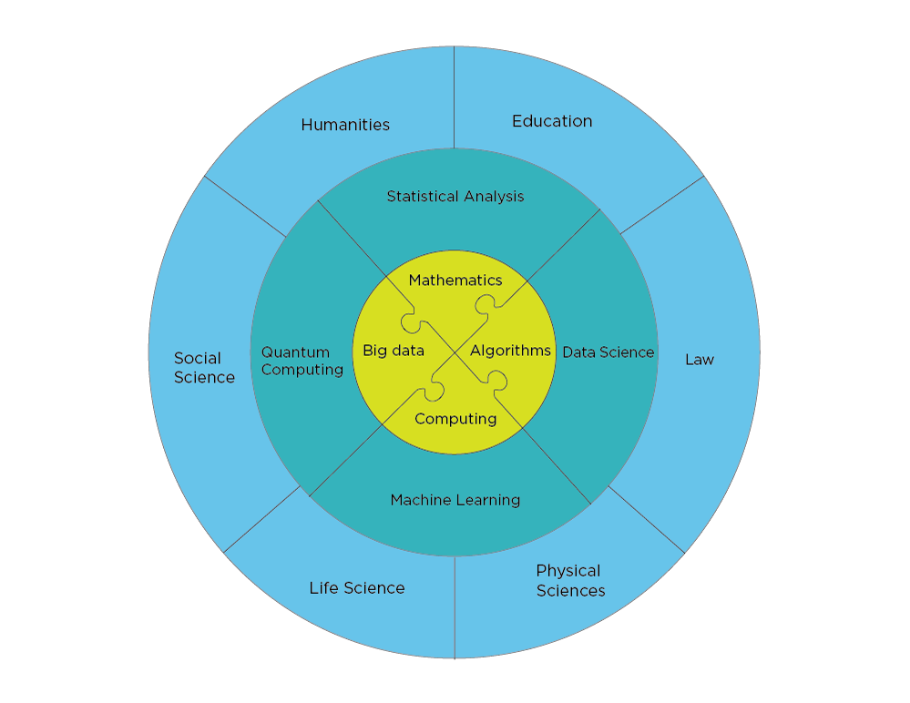

% Planning for the future: Computing Science and Data Science, an input to the strategic plan of MN-FAK@UiO
% **Geir Dahl, Ingrid Glad, Morten Hjorth-Jensen, Ole Christian Lingjærde, Heidi Sandaker, Anne H. Schistad Solberg and Geir Olve Storvik**
% Oct 30, 2018

### Executive Summary

Scientific computing plays a central role in scientific investigations
and is central to innovation in most domains of our lives. It
underpins the majority of today's technological, economic and societal
feats. We have entered an era in which huge amounts of data offer
enormous opportunities, but only to those who are able to harness
them.  [By 2020, it is also expected that one out of every two jobs in
the STEM (Science, Technology, Engineering and Mathematics) fields
will be in computing](http://pathways.acm.org/executive-summary.html)
(Association for Computing Machinery, 2013).

Furthermore, the [3rd Industrial
Revolution](http://www.economist.com/node/21553017) will alter
significantly the demands on the workforce. To adapt a
highly-qualified workforce to coming challenges requires strong
fundamental bases in STEM fields. Computational Science can provide
such bases at all stages. Most of our students at both the
undergraduate and the graduate level are unprepared to use
computational modeling, data science, and high performance computing –
skills valued by a very broad range of employers. 

These developments, needs and future challenges,
will play an essential role in shaping future technological
developments. Most of these developments require true
cross-disciplinary approaches.

This document aims at developing strategies for meeting
these future challenges.  One important step in order to meet the
future, is the hiring of new researchers and faculty with the
competences and skills which are needed in order to harness the many
new possibilities, as well as developing new research and educational
strategies that can serve our society at large.

We propose the following:
1. the injection of 15-20 new faculty and researchers  focusing on the science of computational modeling and data science;
2. the foundation for developing joint cutting-edge graduate and undergraduate programs in computational science and data science. 

### Research and Education, an outline

#### Research

A central element in addressing the above needs and challenges is the hiring of new faculty and researchers. 
We recommend a model where 15-20 new positions (faculty and researchers, permament and/or temporary) are earmarked for the departments of Mathematics and Informatics 
in order to develop new research and educational directions in computational science and data science.

The new faculty will thus be tasked with developing new research and
educational programs in Computational Science and Data Science. We argue strongly that the
hired faculty can/should have shared positions with existing departments
(for example a 70% position at say Mathematics or Informatics  and 30% at the
department of Physics), similarly, faculty with a computational
profile and interest at existing departments can have shared positions
at the department of mathematics and informatics. This will ensure transfer of knowledge as well
as the establishment of new and cross-disciplinary research and
oversee the development of new educational programs and efforts.

These efforts will open doors to new scientific challenges, will
enable UiO to compete and propose new Center-level funding
opportunities as well as totally new research areas (in the Humanities
for example) in computation and data-driven related areas that are
currently beyond our reach. It will facilitate the training of
scientists and students to be an effective 21st century workforce.  It
will also develop courses on modern computational techniques and data
modeling that meet the needs of society, both for the public and the
private sector. 

#### Education

We have already developed (started fall 2018) two new Master of
Science programs, one in [Computational Science](http://www.uio.no/english/studies/programmes/computational-science-master/index.html) which includes almost all
disciplines at the MNFak and one on [Data Science](http://www.uio.no/english/studies/programmes/datascience-master/index.html).  These
programs form the basis for our educational efforts that will lead to
an **across the disciplines PhD program** serving the whole
university. 

A central aspect is the development and  coordination of many of the  educational
activities in computational science and data science. 

We propose

1. Develop a comprehensive set of courses and degree programs at both undergraduate and graduate levels that will give students across the university exposure to practical computational methods, understanding how to analyse data and more generally to the idea of computers as problem-solving tools. The courses and the degree programs can also be offered as intensive training courses and programs.	
2. Develop a Bachelor program in Computational Science and Data Science
3. Develop an all university PhD program in Computational Science and Data Science.
4. Based on the new programs (start fall 2018) on Computational Science and Data Sciece, Develop an all university Master of Science Program in Computational Science and Data Science.
5. Develop courses and course modules in Computational Science and Data Science for the private and the public sectors.
6. Develop a Master of Science program and a PhD program in Computational Science and Data Science tailored to the needs of the private and the public sectors, allowing for students residing outside UiO to develop their knowledge about Computational Science and Data Science.
7. Be a driving force in the education of  the next generation of school teachers and university teachers,  with a strong focus on digital competences. 

### Why should we focus on Computational and Data Sciences?

Modern problems in science and engineering bridge a vast range of
temporal and spatial scales and include a wide variety of physical
processes. The analysis of such problems is not possible, so one must
turn to computation. To develop computational tools for such complex
systems that give physically meaningful insights requires a deep
understanding of approximation theory, high performance computing, and
domain specific knowledge of the area one is modeling. National
laboratories like [SIMULA research lab](https://www.simula.no/) have
addressed the interdisciplinary nature of computing by having experts
in numerical algorithms co-located with disciplinary experts who have
a deep understanding of computation, and who use scientific computing
to address key topics in science.

The proposed organization with algorithmic scientists and disciplinary
scientists in STEM fields as well as other fields is what facilitates
the exploration of challenging multi-disciplinary and
interdisciplinary topics that could not otherwise be addressed. This
key observation motivates the model for the shared positions, with Mathematics and Informatics as the driving departments.

In addition, the synergy of
data-driven computational modeling, combining aspects of traditional
scientific computing with data science and data mining, is an exciting
topic that this new unit will be uniquely suited to address. This is a
rapidly emerging field that touches many of the STEM disciplines but
also Medicine, Education, the Humanities and the Social Sciences, and
attracting world-leading talent in this area is greatly facilitated by
the the above organizational structure and educational programs.

Furthermore, the development of
Computational and Data Sciences has the potential to catapult UiO into
the position of being a leader in this critical new field, and will
open doors to new scientific challenges as well as new Center-level
funding opportunities.

#### Strengths, Possibilities and Synergies

The University of Oslo has within several of the STEM fields strong research and educational activities, exemplified through for example:
* Several Centers of excellence in research where Computational Science plays a major role
* A newly established center of excellence in education research
* Newly established Master of Science programs in Computational Science and Data Science
* Several excellent groups in STEM fields that do Computational Science and Data Science
* Computational topics are included in all undergraduate STEM programs, with the possibility to develop a bachelor program in Computational Science and Data Science for all university colleges
* Several educational prizes and awards related to computational science 
* Strong links with research laboratories like SIMULA research lab
* UiO has the potential to develop cross-college educational programs in Computational Science and Data Science, from undergraduate programs to PhD programs that serve also the public and the private sectors
* The courses to be developed can be offered to train employees and students outside UiO, serving thus the coming needs of for example Machine Learning for the public and the private sectors

With a close coordination between the department of Mathematics and Informatics, as well as other involved departments, we have the possibility to really position UiO as the leading Norwegian and perhaps European institution within Computational Science and Data Science.

#### Enhance Computational Science and Data Science across the disciplines

Data driven discovery and data driven modeling play already a central role in research. The global objective here is to strengthen and coordinate such activities by bringing together scientists and students across the disciplines.
UiO has already strong computational research and education activities within Mathematics and the Natural Sciences.
The aim here is to extend this to include

* Computational Science and Data Science in Mathematics and all of the physical sciences (Astrophysics, Chemistry, Geoscience and Physics)
* Bioinformatics
* Develop research programs in [Quantum Computing and Quantum Information theory](https://www.aps.org/publications/apsnews/201802/ostp.cfm?utm_source=APS+Physics+Main+Group&utm_campaign=fb7a2e7d6b-News+021218&utm_medium=email&utm_term=0_825303224b-fb7a2e7d6b-106513221). Many universities are now developing research and [educational strategies in Quantum Computing](https://vprgs.msu.edu/event/interdisciplinary-forum-quantum-information-science)
* Develop data-driven discovery research programs utilizing recent developments in machine learning
* Computational life science
* Computational Materials Science
* Computational Economy and Data Science and computing in Law and the Social Sciences
* Data Science and computing in the Humanities

The department of Mathematics and Informatics  will host and coordinate research and educational programs in Computational Science and Data Science. In particular research and education that involve  data analysis and Machine Learning will play a central role here. 

### Courses and degree programs

Creation of a robust, coherent set of undergraduate and graduate degrees, with accompanying
courses, supports two complementary goals. First, a coherent program will allow the university
to consolidate undergraduate and graduate training in computation in the STEM fields as well as introducing computing to other disciplines, reducing
redundancy in the courses taught and allowing the university to offer a wider range of more
specialized advanced courses. Second, we will create a robust set of degrees that are designed to give our 
students a strong introduction to computing
that will complement UiO’s existing disciplinary training, and which will make them better suited
to be a part of the workforce in the 21st century, but also to be able to develop and use computing and data Science across the disciplines. These programs will include:
1. An undergraduate program in Computational and Data Sciences tailored to various disciplines.
2. We have already (from fall 2018) two new Master of Science programs in Computational Science and Data Science dailored to STEM fields. The aim is to extend these to other colleges.
3. Develop a cross-college PhD program in Computational Science and Data Science.
4. Develop courses and course modules in Computational Science and Data Science for the private and the public sectors.
5. Develop a Master of Science program and a PhD program in Computational Science and Data Science tailored to the needs of the private and the public sectors, allowing for participants residing outside UiO to develop their knowledge about Computational Science and Data Science.
6. Be a driving force in the education of  the next generation of school teachers and university teachers,  with a strong focus on digital competences. 

This range of options will allow some number of students to dive deeply into
computation through the degree programs, and will enable a much broader swath of the UiO
population to learn about some aspects of computational and data science through not only the various programs but also through the courses to be developed by the departments of Mathematics and Informatics.

One desired result of the creation of these
courses and programs is the foundation of a strong community of students from different
disciplines who use similar techniques to solve a wide range of problems, which will promote
broad, interdisciplinary thinking and will help to raise the visibility of computing throughout the UiO campus. We note that an extra benefit of these educational
efforts is that UiO will become an ideal place to perform research in computational science
education, a topic of critical importance that has thus far received little scholarly attention. The foresee  strong links with the recently established Center for Computing in Science Education. 

#### Long term goals and sustainability

The overall goal of this focus on Computational Science and Data Science is to bring together world-leading
faculty who combine the most important aspects of computation and
disciplinary research, thus enabling cutting-edge interdisciplinary
science and the training of both undergraduate and graduate
students. The involved departments will be economically sustained through the standard base
university funding.
However, additional funds will be
realized by the securing for example Center-level funding (as well as many
single- or few-PI grants), as well grants obtained the PIs that sustain graduate
students, post-docs, travel and other associated expenses.  

Basic university funding (beyond faculty
and support staff salaries) is necessary to support fellowships for
top graduate students, speaker series and honoraria, visitor support,
hardware purchases, and startup packages.

The enclosed appendices contain more details about research and education plans. Links to
similar and recently established initiatives  are also presented.

### Appendix A: Working group members ( 2018)

1. IFI: Ole Christian Lingjærde and Anne H. Schistad Solberg
2. Math: Geir Dahl, Ingrid Glad, and Geir Olve Storvik
3. Physics: Morten Hjorth-Jensen and Heidi Sandaker

### Appendix B: Structure and Justification for Planned Organization

The joint appointments with other departments will play an important
role in cementing the role of Computational Science and Data Science,
strengthening cross-disciplinarity collaborations. Furthermore, the
task of developing new and joint courses will require extensive
collaborations across departments. As an example, the faculty and
researchers we plan to hire could have a 70% appointment with the
department of Mathematics or Informatic and 30% with a single
discipline oriented department. Similarly, a researcher with linked to
the department of Chemistry, could have a shared position of for
example 20% at the Department of Mathematics and 80% at the department
of Chemistry. These joint appointments will facilitate the seeding of
new research and the development of new courses and degree programs.

One can view the departments of Mathematics and Informatics as hubs
which focus on Algorithms, Computing, Big Data, Mathematics, Quantum
Computing, Machine Learning and Statistical Analysis in close
collaboration with scientists working from the Physical Sciences
(Chemistry, Astrophysics, Physics, Geoscience, Mechanics, Materials
Science), Life Science (Bioscience and Medicine), Law, Education,
Social Sciences and the Humanities. The new department will develop
and strengthen the field of Computational Science and Data Science in
close collaboration with all involved departments (from the MNfak and
other colleges), increasing thereby the overall general competences of
our students and scientific staff on these topics.  The following
figure illustrates schematically these links, with the two inner
circles representing the most likely key research activities we wish to strengthen.

<!--  -->

#### Funding

In order to secure funding in addition to those guaranteed by the
University and the ministry of education and research, one should seek
assiduously center funding from the Norwegian SFF and SFI system
(under the auspices of the Research Council of Norway) as well as
similar funding possibilities from the EU. In addition, we expect the
faculty to bring in regular research grants either from industry, the
Research Council of Norway or the EU.

We aim also at exploring and having, out of the 15-20 positions, five
positions at the level of associate or full professor as endowed
chairs and professorships from the private sector. We will in
particular target companies where computational science and data
science will play a major role in the future. The design of research
projects linked to the needs of these companies as well as the PhD and
Master of Science programs discussed below, will make sure that both
the private and the public sector will benefit from highly qualified
candidates.

Below we discuss several possible research directions where faculty
hires can start new research directions, in close collaborations with
specialists from various departments.

### Appendix C:  Sampling of new and transformational science that can be enabled

There are several new and emerging research directions where
Computational science and Data science will play and can play a major
role.

#### Computational life science

The Life Sciences is transforming with the explosion of
High-throughput data generation technologies and the need for
integrating these across all the levels of the biological hierarchy. A
'system-dynamic' (Systems Biology) approach will dominate research in
the coming decades. Here, computational modelling to integrate the
various data types and data sets will be a driving force. Similar
developments are seen in the field of molecular image analysis, where
computational methods to integrate the image streams will become
essential to make sense of the growing amount of data. Translational
Bioinformatics, bridging the gap between the laboratory, computer and
the clinic, with the ultimate goal of personalised medicine, is an
important, and exciting new dimension. Many of these developments
require cross-disciplinary thinking, and often breakthroughs in
Bioinformatics/Computational Life Science start with creatively
adjusting and implementing algorithmic or computational solutions
originally developed for other fields. A CDS department that has
multidisciplinarity as its founding principle, and brings
computationally skilled researchers from many fields together, will
provide a solid foundation for researchers working towards these
developments.

#### Develop data-driven discovery research programs utilizing recent developments in machine learning

 **Machine Learning** plays nowadays a central role in the analysis of
large data sets in order to extract information about complicated
correlations. This information is often difficult to obtain with
traditional methods. For example, there are about one trillion web
pages; more than one hour of video is uploaded to YouTube every
second, amounting to 10 years of content every day; the genomes of
1000s of people, each of which has a length of $3.0\times 10^9$ base
pairs, have been sequenced by various labs and so on. This deluge of
data calls for automated methods of data analysis, which is exactly
what machine learning provides.  Developing activities in these
frontier computational technologies is thus of strategic importance
for our capability to address future science problems. The
applicability of big data, data-driven discoveries, data-driven
modeling and machine learning covers basically all disciplines and
fields, with applications spanning from materials science, mechanics,
medicine, applied mathematics, economic forecasting etc. Machine
learning and big data concepts are being exploited in more and more
fields.  The big data challenge will be in the forefront of biology
and life science research in the next few years.  In materials science
machine learning allows us to parametrize results from quantum
mechanical calculations in terms of classical interactions. These
interactions are in turn suitable for large scale molecular dynamics
simulations of complicated systems spanning from subatomic physics to
materials science and life science.  To develop a multiscale science
program starting with the smallest constituents and moving to larger
systems can most likely only be done with the development and
application of machine learning algorithms.  Economists and policy
makers need up-to-date information on the state of the economy to
formulate effective policies. Variables such as GDP, Gini factors,
unemployment rates, quality of life data etc are normally used as key
indicators. These data are often only available with delays between
collection and availiability to analysts, making it thus difficult to
asses properly their relevance. Machine learning algorithms have the
potential to deliver improved predictions as well as correlations and
proper error estimates. The examples discussed here represent just a
few of the possible applications of Machine Learning algorithms that
the new department can aid in developing. To develop these research
lines will be achieved most effectively within the multidisciplinary
CDS department.

#### Develop research programs in Quantum Computing and Quantum Information theory

Enabling simulations of large-scale quantal many-particle systems is a
long-standing problem in scientific computing.  Quantum many-particle
interactions define the structure of the universe, from nucleons and
nuclei, to atoms, molecules, and even stars. Since the discovery of
quantum mechanics, a lot of progress has been made in understanding
the dynamics of certain many-particle systems. While some of our
insight comes from a small set of analytically solvable models,
numerical simulations have become a mainstay in our understanding of
many-particle dynamics. The progress in numerical simulations has
accelerated in the last few decades with the advent of modern high
performance computing (HPC) and clever developments in classical
simulation algorithms such as, quantum Monte Carlo,large-scale
diagonalization approaches, Coupled-Cluster theory and other
renormalization schemes.  Despite the monumental advances, classical
simulation techniques are reaching fundamental limits in terms of the
size of the quantum systems that can be processed. Fortunately, the
disruptive new field of quantum simulations has emerged, promising to
enable simulations far beyond those which are classically
tractable. In particular, scientific applications concerned with
simulations of interacting fermions on a lattice are poised to reap
the benefits of quantum simulations.  Mathematical models of
interacting fermions naturally extend to describe vastly different
physics such as that of correlated electronic and the correlated
nuclear systems.

 Recent progress in quantum computing as well as digital and analog
Quantum Algorithms (QAs) promise to enable the exciting possibility of
performing simulations that are beyond the reach of all existing and
future classical supercomputers. Despite the progress, there is still
a gap between the resources required by state-of-the-art QA and the
resources offered by available and near-future quantum hardware. It
may take decades of quantum hardware development and engineering
before the current QAs will outperform classical exascale class
simulations. Therefore, to impact scientific computing on a more
relevant time scale, improving the scalability and efficiency of
quantum simulation algorithms is of the highest
importance. Developments in quantum information algorithms and their
mathematical properties, as well as their applications will play a
critical role in studies of relevance for a wide variety of fields,
from the design and studies of new materials to our basic
understanding of systems of interest in chemistry and physics. The new
department, in close collaboration with disciplinary experts, can play
an essential role in developing this field by hiring world-leading
experts in quantum information theory and quantum computing.

#### Computational Social Science

Survey data, the engine of the behavioral revolution of the social
sciences is about to run its course, with low response rate and poorly
representative samples being the norm rather than the exception.
Fortunately, vast amount of new information from social media, via
digitalized governmental archives, to population registries are
opening up new exiting avenues for innovative social science research,
such as paternity leave and children’s performance in school, extent
of censorship in Chinese online new reporting, or conditions for
receptiveness to fake news. Moreover, the new data availability in
combination with tools from machine-learning has spurred an interest
in prediction and sophisticated policy-recommendations, ranging from
optimize relocation of immigrants given their skill-set and local
labor market needs, via probabilistic detection of election fraud, to
forecasting of popular unrest and civil war. The undertaking of such
research questions was, until recently, outside the realm of social
science. There are however limits to the amount of new insights that
can be obtained purely from richer data and “black-box” import of
machine-learning tools. More robust, new insights require similar
steps to be taken in the development of applied, testable, theoretical
models to facilitate direct empirical evaluations of the model
dynamics and the consistency of the model with the data. Such a step
requires a solid grounding in computing.

#### Computational Geoscience

Geoscience has long been a computationally-intensive area. A typical
climate simulation, used for example in the future projections
discussed by the Intergovernmental Panel on Climate Change (IPCC), can
generate a petabyte (1 million gigabytes) of data. Weather forecasts
involve suites of complex simulations, which are then averaged to
assess the probability of different scenarios. These models simulate
not only the atmosphere, but the important interactions with the
ocean, land and vegetation. Sophisticated models are also used for
studying tectonic continental shifts, to understand the geology and
climate of previous epochs, thereby informing our understanding of
prehistoric life. And similar models are used to simulate hydrological
reservoirs and the melting occurring at the base of major
glaciers. Computation is so central to the geosciences that it is
impossible to imagine the study without it.

The computational approaches relevant for geoscience can be grouped in
two classes: simulation and analysis. Geoscientific computation
demands advance programming techniques and optimized simulations, to
ensure the fast calculations. Changes in the global ocean circulation
can take tens of thousands of years, demanding the most rapid
simulations possible. High performance computing approaches, for
example using graphical processing units (GPUs), are now being applied
to climate models, greatly increasing performance.  The large amount
of data generated by geophysical simulations is also a challenge and
is well-suited for big data techniques. Machine learning is beginning
to be used in weather forecasting and in climate simulations. This has
led to the identification of weather patterns missed by researchers
and to the identification of extreme events like cyclones and
“atmospheric rivers”, on par with that of human
analysts. Computational geoscience is an exciting and developing
field, and one which will make major inroads to the earth sciences in
the future.

#### Computational Psychology

Large files of audio/video are currently unused since data is in a
form that is unavailable for quantitative analysis (such as video of
weekly clinical interviews from multi-center trials of treatment for
thousands of patients). Analysis of prosody can shed light on change
processes, and should automatic transcription reach a sufficiently
good level, this will, in combination with natural language
processing, open up many interesting research questions.

Accumulated data from online use already provides measurements of
quantities such as personality, attitudes, skills or mental disorders
which in many cases have proven to approach the level of the best
instruments we have. Here one obtain much more, especially since
clinical treatment will increasingly be supplemented by electronic
registrations in the future, as well as being able to disconnect data
from sensors in smart devices. Present instruments in use generate
relatively large amounts of data (from for example EEG, ERP, and fMRI), and newer
methods of pattern recognition/classification can shed light on a
number of research questions.

#### Machine learning in education research

Quantitative education research has historically been done at the
micro-scale (classrooms) and the macro-scale (K-12, baccalaureate
degree programs, etc.). Micro-scale research has been done using
traditional correlational statistics with data gathered from surveys,
conceptual tests, classroom observations, etc. With the advent of the
*digital classroom* student behavior can now be examined in fine
grain. Students access of online homework platforms, video lectures,
and interactions with peers via online course forums has created new
data sources for education researchers. New technologies such as
computer textual analysis can pick apart student conceptual
understanding of hard concepts in science and mathematics. Intelligent
tutors can provide real time feedback to students as they solve
problems. At the macro-scale students’ career decisions within their
programs can be modeled. What courses they choose to take, who they
choose to take courses from, and their comments on said courses, form
new data sets which can be used to predict student decisions and
provide timely feedback to students and faculty advisers. Ultimately
these data sets can form a high dimensional picture of student
learning painted by machine learning.

### Appendix D:  Outline of degree programs and courses

This appendix summarizes the set of degree programs and courses that
can/should be administered by the department of mathematics. The range of
offerings gives students the opportunity to engage with computational
science at a variety of levels, from single courses to graduate
programs. Market research and feedback from employers indicate that
engaging with one or more of the proposed programs will substantially
enhance the student's career prospects. The new classes will move to
the new department once the department opens ist doors.

#### Degree programs

The MNFak  offers from fall 2018 two new programs at the Master of Science level in Computational Science and Data Science. These programs are
1. [Computational Science](http://www.uio.no/english/studies/programmes/computational-science-master/index.html), start fall 2018. It is presently administrated by the department of Physics, but it belongs naturally under the department of Mathematics. It should be transfered to Mathematics by fall 2020.
2. [Data Science](http://www.uio.no/english/studies/programmes/datascience-master/index.html), start fall 2018. Administrated by the department of Mathematics
3. Develop a Bachelor of Science program in Computational Science and Data Science, hosted by the Department of Mathematics. Start fall 2020.
4. Develop an all university PhD program in Computational Science and Data Science by fall 2020
5. Based on these programs and the gained experiences we plan to develop a Master of Science program in Computational Science and Data Science tailored to the needs of the private and the public sectors. This will allow students residing outside UiO to develop their knowledge about Computational Science and Data Science by fall 2021
6. Develop a PhD program in Computational Science and Data Science tailored to the needs of the public and the private sectors (so-called nærings PhD in Norwegian)

The Master of Science and PhD programs that will target students from outside UiO (from partner companies, public and private sectors)
will be developed in close collaboration with external stake holders. 

#### Courses

There are several existing and planned courses which could be offered.

The University of Oslo offers the following courses in Computational Science, split here according to main disciplines/fields.  

                                       Mathematics  and Computer Science, including Mechanics and Statistics                                          
----------------------------------------------------------------------------------------------------------------------------------------------------  
       [MAT-INF3360 Introduction to Partial Differential Equations ](http://www.uio.no/studier/emner/matnat/math/MAT-INF3360/index-eng.html)          
                    [MAT-INF4110 Mathematical Optimization](http://www.uio.no/studier/emner/matnat/math/MAT-INF4110/index.html)                       
                  [MAT-INF4130  Numerical Linear Algebra](http://www.uio.no/studier/emner/matnat/math/MAT-INF4130/index-eng.html)                     
                     [MAT-INF4140 Numerical Analysis ](http://www.uio.no/studier/emner/matnat/math/MAT-INF4140/index-eng.html)                        
                [MAT-INF4160 Topics in Geometric Modelling ](http://www.uio.no/studier/emner/matnat/math/MAT-INF4160/index-eng.html)                  
     [MAT-INF4300 Partial differential equations and Sobolev spaces I](http://www.uio.no/studier/emner/matnat/math/MAT-INF4300/index-eng.html)        
    [MAT-INF4310 Partial differential equations and Sobolev spaces II ](http://www.uio.no/studier/emner/matnat/math/MAT-INF4310/index-eng.html)       
          [MEK4250 Finite Element Methods in Computational Mechanics](http://www.uio.no/studier/emner/matnat/math/MEK4250/index-eng.html)             
                    [MEK4470  Computational Fluid Mechanics](http://www.uio.no/studier/emner/matnat/math/MEK4470/index-eng.html)                      
                        [INF4300 Digital image analysis](https://www.uio.no/studier/emner/matnat/ifi/INF4300/index-eng.html)                          
               [INF4331 Problem solving with high level languages](http://www.uio.no/studier/emner/matnat/ifi/INF4331/index-eng.html)                 
[INF4820 Algorithms for artificial intelligence and natural language processing](https://www.uio.no/studier/emner/matnat/ifi/INF4820/index-eng.html)  
         [INF5620 Numerical Methods for Partial Differential Equations](http://www.uio.no/studier/emner/matnat/ifi/INF5620/index-eng.html)            
    [INF5631 Project on Numerical Methods for Partial Differential Equations](http://www.uio.no/studier/emner/matnat/ifi/INF5631/index-eng.html)      
                    [INF5670 Numerical methods for Navier-Stokes equations](http://www.uio.no/studier/emner/matnat/ifi/INF5670/)                      
                         [INF5840 Computability theory](https://www.uio.no/studier/emner/matnat/ifi/INF5840/index-eng.html)                           
                  [INF5850 Machine Learning for Image Analysis](http://www.uio.no/studier/emner/matnat/ifi/INF5860/index-eng.html)                    
           [STK4021 Applied Bayesian Analysis and Numerical Methods](http://www.uio.no/studier/emner/matnat/math/STK4021/index-eng.html)              
           [STK4520 Laboratory for Finance and Insurance Mathematics](http://www.uio.no/studier/emner/matnat/math/STK4520/index-eng.html)             

                        Physical Sciences: Physics, Astrophysics, Geosciences and Chemistry                          
-------------------------------------------------------------------------------------------------------------------  
        [FYS4150 Computational Physics I](http://www.uio.no/studier/emner/matnat/fys/FYS4150/index-eng.html)         
              [FYS4411 Computational Physics II](http://www.uio.no/studier/emner/matnat/fys/FYS4411/)                
              [FYS4460 Computational Physics III](http://www.uio.no/studier/emner/matnat/fys/FYS4460/)               
         [GEO4310 Stochastic methods in hydrology](http://www.uio.no/studier/emner/matnat/geofag/GEO4310/)           
[GEO4510 Atmosphere and Oceans on Computers: Fundamentals ](http://www.uio.no/studier/emner/matnat/geofag/GEF4510/)  
    [GEO4450 Geophysical Fluid Dynamics ](http://www.uio.no/studier/emner/matnat/geofag/GEF4450/index-eng.html)      
        [AST5210 Stellar Atmospheres I](http://www.uio.no/studier/emner/matnat/astro/AST5210/index-eng.html)         
         [AST9110 Numerical Modeling](http://www.uio.no/studier/emner/matnat/astro/AST9110/index-eng.html)           

                                                        Bioscience including Bioinformatics                                                           
----------------------------------------------------------------------------------------------------------------------------------------------------  
                      [INF4490 Biologically inspired computing](http://www.uio.no/studier/emner/matnat/ifi/INF4490/index.html)                        
                 [INF4350 Introductory Course in Bioinformatics](http://www.uio.no/studier/emner/matnat/ifi/INF4350/index-eng.html)                   
[INF-BIO5121 High Throughput Sequencing technologies and bioinformatics analysis](http://www.uio.no/studier/emner/matnat/ifi/INF-BIO5121/index.html)  
                    [INF5380 High-performance computing in bioinformatics](http://www.uio.no/studier/emner/matnat/ifi/INF5380/)                       
                              [INF5560 Computational Physiology](http://www.uio.no/studier/emner/matnat/ifi/INF5560/)                                 
                    [MBV-INF4410 Bioinformatics for Molecular Biology](http://www.uio.no/studier/emner/matnat/ibv/MBV-INF4410/)                       
                            [MBV3070 Bioinformatics](http://www.uio.no/studier/emner/matnat/ibv/MBV3070/index-eng.html)                               

**Add ML courses asap**

Many of these courses, if properly modularized, can be offered as intensive training courses and programs. In particular, such courses will be attractive for both the private and public sectors. The following courses could be offered
1. Introductory Scientific Python
2. Advanced Scientific Python
3. Data Science and visualization
4. Applied numerical mathematics
5. Computational finance
6. Big data graph analysis
7. Supervised machine learning with scikit-learn and TensorFlow
8. Unsupervised machine learning with scikit-learn
9. Data-driven entrepreneurship
10. Courses tailored to the needs of specific companies
11. and more specialized modules

### Appendix E: Computational Science and Data Science  at Norwegian  universities and other places

In Norway it is only UiO which offers  Master of Science  programs in
Computational Science and Data Science. All other universities have
only Master programs in Computer Science, with minor emphasis on computational science and/or data science. 
The University of Bergen has
a Masters program in Applied Mathematics while UMB has a newly
established program in data science. These are limited and more
focused programs. Nationally, UiO is the only university which offers
broad programs in Computational Science and Data Science.

Norway  University  Comp Science and Data dept       Bachelor program            Master program         Graduate/PhD program     
------  ----------  --------------------------  --------------------------  -----------------------  --------------------------  
           UiO                  No              Proposal under development            Yes            Proposal under development  
           NTNU                 No                          No                         No                        No              
           UiT                  No                          No                         No                        No              
           UiB                  No                          No                    Applied Math                   No              
           UMB                  No                          No                        Yes                        No              
         OsloMet                No                          No                         No                        No              
           UiS                  No                          No                 Planned fall 2019                 No              
           UiA                  No                          No              No, but direction in AI              No              
           UiN                  No                          No                         No                        No              
           USN                  No                          No                         No                        No              

Out of 95 universities polled in the USA, there are less than 15 which
have a department on Scientific Computing and more than 50 that have a
center on Scientific Computing. Between 20 to 30 of these offer a
bachelor, Master of Science or PhD program. On Data Science there are
approximately 30 departments and 40 centers. Almost 50 of these
universities offer a Masters degree in Data Science and close to 40 a
PhD in Data Science.  Out of 95 universities polled in the USA, there
are less than 15 which have a department on Scientific Computing and
more than 50 that have a center on Scientific Computing. Between 20 to
30 of these offer a bachelor, Master of Science or PhD program. On
Data Science there are approximately 30 departments and 40
centers. Almost 50 of these universities offer a Masters degree in
Data Science and close to 40 a PhD in Data Science.  An excellent
example of a department which includes computational science and data
science is the newly established [department at Michigan State
University](https://cmse.msu.edu/).

For the department of Michigan State University, the process which led to the establishment of the new department started fall 2013 and the new department opened its doors in fall 2015. It counts now 31 faculty of which 24 of them have shared positions with other departments. It offers a series of courses at all levels, minors and majors in Computational Science as well as its own graduate program. The department offers also a dual PhD with other departments. This option has been particularly popular with Physics students.

The new hires cover most STEM fields and the department has been
central in starting new cross-disciplinary research activities. There
are strong activities in life science and bioinformatics as well as in
statistics, mathematics, physics, geoscience and engineering. 

Other departments with similar scope and programs  in Northern America are (the list is not exhaustive)
1. [School of Computational Science and Engineering at Georgia Institute of Technology](https://www.cse.gatech.edu/)
2. [Computational Science and Engineering at University of California Santa Barbara](https://cse.ucsb.edu/)
3. [Computational Science and Engineering at North Carolina Agricultural and Tecnological State University](http://www.ncat.edu/coe/departments/cse/index.html)
4. [Computational Science and Engineering at University of Illinois Urbana-Champaign](https://cse.illinois.edu/)
5. [Department of Scientific Computing at Florida State University](https://www.sc.fsu.edu/)
6. [New York University](https://datascience.nyu.edu) 

Most of the other university in Northern America have a typical department of Computer Science. Programs in Computational Science and Data Science are frequently offered by the department of Mathematics and/or the department of Computer Science.
1. Purdue CCAM (Center for Computational & Applied Mathematics)

At the time of writing, no such poll has been made for European universities. From the list over Masters programs, the countries with the largest focus on these topics are Germany ([SimTech in Stuttgart is a good example](http://www.simtech.uni-stuttgart.de/)), Sweden and Switzerland. 
Examples of interest in Europe are the 
* [London School of Economics](http://www.lse.ac.uk/seds/)
* [Imperial College and its Quantitive Sciences Research Institute](http://www.imperial.ac.uk/quantitative-sciences-institute/about)
* [Swiss Institute of Computational Science](https://www.ics.usi.ch/)

while in Austria we have the 
* [Vienna Graduate School in Computational Science](http://www.csc.univie.ac.at/ik/)

The Society for Industrial and Applied Mathematics (SIAM) [keeps track of graduate programs in computational Science](https://www.siam.org/students/resources/cse_programs.php). The list is most likely not complete. 

In addition to the traction seen within data driven discoveries,
Quantum Information Science (QIS) is also gaining considerable
momentum presently. 
This represents a truly cross-disciplinary activity that cannot be placed within one single
department.
Though the disruptive potential of QIS has been
known for over 20 years, it has been in a nascent state with a number
of academic, industrial and government groups striving to understand
the basics physics and to build and control many-qubit systems.
There has been steady progress to a tipping point where the
realization of practical QIS systems is imminent; for example
the leading group in the field (Google Quantum AI) recently argued
that small-scale commercialization of quantum computing devices is
expected within 5 years; moreover quantum chemistry may be a
“killer app” for small quantum computing systems; and prototype
demonstrations are already emerging.  IBM is providing a 20 QUBIT
system for public use, and they expect to deliver a 50 QUBIT system in
the near future.

Strategic partnerships are developing between universities, large
corporations, startups, as well as federal and private funding
agencies in the USA.  Some of the major industrial and government investors are
Google, IBM and Microsoft. In the USA both the Department of Energy 
and the National Science Foundation are developing 
QIS programs with several new initiatives.

### Appendix F: Research in Computational Science at UiO

#### Computational Physics

#### Computational Bioscience

#### Bioinformatics

#### Imaging and Biomedical Computing

#### Astrophysics

#### Computational Life Science

#### Computational Geoscience

#### Applied mathematics, mechanics and Risk analysis

### Appendix G: Research in Data Science

